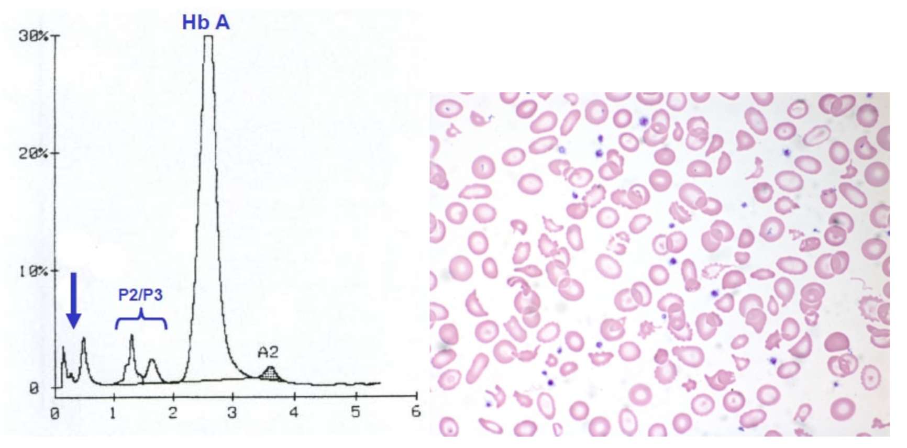
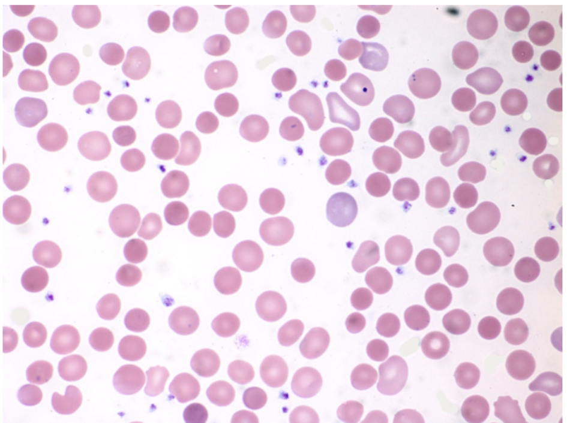
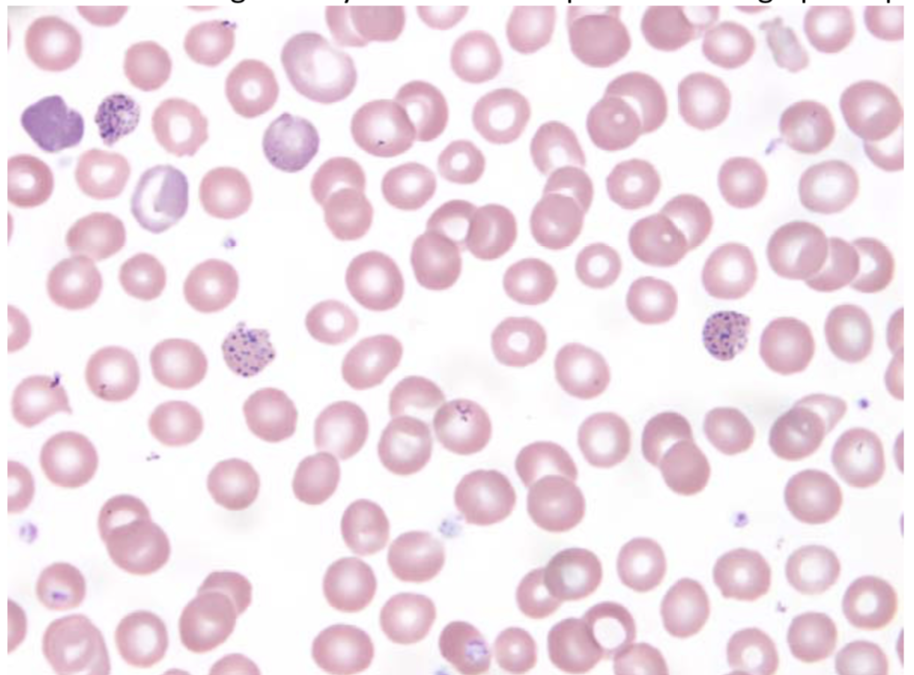
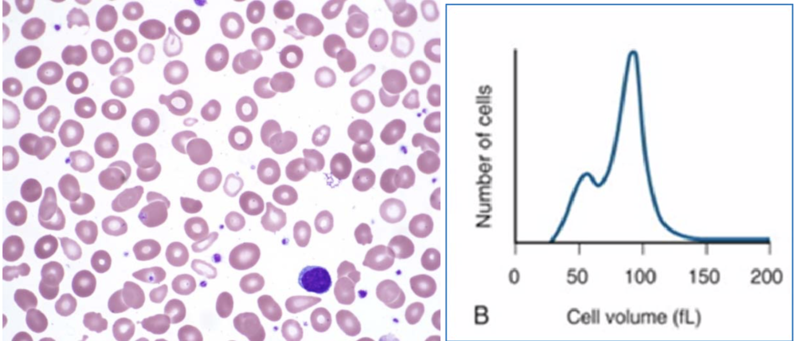
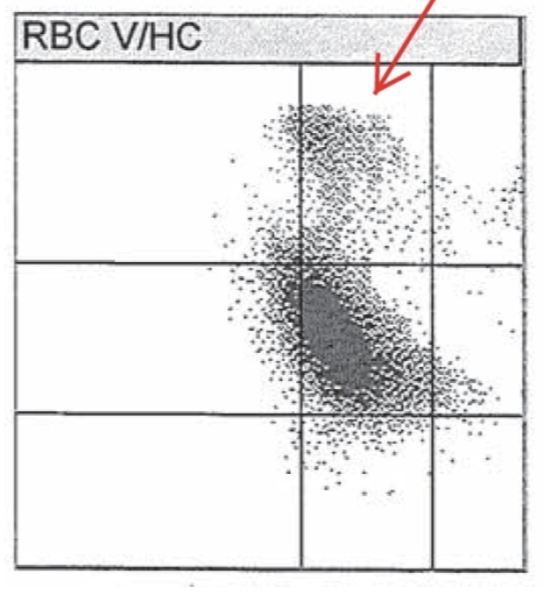

```{r setup, include=FALSE}
library(learnr)
library(glue)
knitr::opts_chunk$set(echo = FALSE)
```


## Introduction

Each page contains the following sections:

- **Question stem** <br> may include clinical history, associated image, lab data, etc. 

- **List of possible answers** <br>
correct answer + 4 distractors

## Questions

### Question 1 
```{r q1}
question("Which of the folllowing compound heterozygous conditions is expected to be least symptomatic in terms of anemia and hemolysis?",
    answer("A. Hemoglobin S/beta+ thalassemia"),
    answer("B. Hemoglobin S/hemoglobin C"),
    answer("C. Hemoglobin S/hemoglobin D"), 
    answer("D. Hemoglobin S/hemoglobin Lepore"), 
    answer("E. Hemoglobin S/hemoglobin J‐Baltimore", correct = TRUE), 
    allow_retry = TRUE, 
    post_message = "All of the entities listed result in a sickling disorder with resultant hemolytic anemia that varies in severity with the exception of compound heterozygosity for hemoglobin S/J‐Baltimore. 
    
Hemoglobin S/beta0 thalassemia shows a similar electrophoretic profile to hemoglobin SS disease (sickle cell disease), although affected patients are microcytic with evidence of basophilic stippling on peripheral smear and typically have higher levels of hemoglobin A2.

The percentage of hemoglobin A and severity of hemolysis in hemoglobin S/beta+ thalassemia varies depending on the type of mutation on the beta globin gene harboring the thalassemia mutation and the resultant degree of alpha chain:non‐alpha chain imbalance.

Hemoglobin SC disease and SD disease both result in a sickling disorder, while the presence of any of these hemoglobin variants in a carrier state (hemoglobin S trait, hemoglobin C trait, hemoglobin D trait) is of limited clinical significance and is not associated with abnormal red cell parameters (with the exception of hemoglobin C trait, which may be associated with slight microcytosis); diagnosis of these carrier states is mainly of importance in terms of their potential combination with other hemoglobin variants leading to a symptomatic hemoglobinopathy in offspring.

Hemoglobin J‐Baltimore is a beta globin chain variant that is not known to be associated with clinical or hematologic abnormalities (see case 23i). Therefore, co‐inheritance of hemoglobin S and hemoglobin J‐ Baltimore is expected to behave similarly to sickle cell trait. The same is also true for co‐inheritance of hemoglobin S trait and hemoglobin G‐Philadelphia trait, although the latter is an alpha chain variant (see case 23g).

**References**

Study set cases/sections 14, 20, 23g, 23i, 31, 32, 34h.

Bain BJ. Hemoglobinopathy Diagnosis (2nd edition). Blackwell: Malden, MA, 2006. p. 139‐189."
)
```

### Question 2
```{r q2}
question("A 30‐year‐old man is seen in follow‐up by his PCP for microcytosis and mild anemia (MCV 76 fL [normal: 80‐100], Hgb 12 g/dL [normal: 13.5‐17.5], Hct 40% [normal: 41‐53]) that was incidentally discovered on routine CBC. Iron studies are within normal limits and hemoglobin electrophoresis by high‐performance liquid chromatography (HPLC) shows no abnormalities.

You note in reviewing the patient’s medical record that his partner is pregnant with their first child and both are of the same Asian ethnic background. You advise the PCP that as a next step in evaluation:",
    answer("A. A repeat sample should be submitted for hemoglobin analysis, because the normal results imply sample mix‐up or a testing‐related error.
"),
    answer("B. A follow‐up sample should be submitted for hemoglobin analysis by capillary electrophoresis, which has a higher sensitivity for picking up abnormal variants."),
    answer("C. The patient likely has alpha thalassemia minor and a sample should be drawn from the patient’s partner and submitted for routine hemoglobin electrophoresis."), 
    answer("D. The patient likely has alpha thalassemia minor and a follow‐up sample should be submitted to look for alpha globin gene deletions by PCR and multiplex ligation‐dependent probe amplification (MLPA).", correct = TRUE), 
    answer("E. The patient likely has alpha thalassemia minor, but since this is an asymptomatic condition and he has only mild microcytosis and anemia, further investigation or follow‐up is not clinically warranted."),
    allow_retry = TRUE, 
    post_message = "The clinical presentation and laboratory data are consistent with alpha thalassemia minor (trait), which is not detectable by routine hemoglobin electrophoresis regardless of the method use. Therefore, choices A and B are incorrect. Choice E (no further follow‐up) may be a reasonable option in certain circumstances; however, given that the patient’s partner is pregnant, further investigation is clinically indicated since his alpha globin status could have consequences for their child. The best answer is choice D, because it is most important to determine the patient’s alpha globin genotype as a next step, in order to determine whether he has a deletion or mutation affecting a single alpha globin gene or two alpha globin genes. If he has a two‐gene deletion, follow‐up of testing of his partner would be a subsequent step in helping to determine whether the fetus may be affected; however, such testing would not be done by hemoglobin electrophoresis, which would not show any abnormality even if his partner also had alpha thalassemia trait, but by alpha globin dosage analysis by PCR and MLPA. 

**References**

Study set cases/sections 27, including 27d.

Bain BJ. Hemoglobinopathy Diagnosis (2nd edition). Blackwell: Malden, MA, 2006. p. 64‐79."
)
```

### Question 3

{width="80%"}
```{r q3}
question("A one‐year‐old boy with anemia is evaluated following a newborn screen showing hemoglobin Bart’s. A hemoglobin electrophoresis study by HPLC shows the following results, with an abnormal, fast‐moving peak as indicated by the arrow. A representative image of his peripheral blood smear is shown. What is this patient’s alpha globin genotype?", 
         answer("A. ‐‐/‐‐"), 
         answer(glue("B. --/-{a}", a = "$\\alpha$"), correct = TRUE), 
         answer(glue("C. -{a}/-{a}", a = "$\\alpha$")), 
         answer(glue("D. --/{a}{a}", a = "$\\alpha$")),
         answer(glue("E. -{a}/{a}{a}", a = "$\\alpha$")), 
         allow_retry = TRUE, 
         post_message = "This patient has hemoglobin H disease or alpha thalassemia intermedia with compound heterozygosity for alpha0 and alpha+ thalassemia. This condition results in a moderate to severe hemolytic anemia that varies in symptomatology depending on the combination of mutations inherited, which are typically deletional in nature. 

Hemoglobin H represents an insoluble tetramer of 4 beta chains and is typically seen as a fast‐moving double‐peak on HPLC as show in the electrophoretogram (see case 28A of study set).

At birth, patients with hemoglobin H disease often have some amount of hemoglobin Bart’s (tetramer of 4 gamma chains) on newborn screen or electrophoresis, which can persist into childhood (see case 28B of study set). However, true hemoglobin Bart’s disease with loss of all 4 alpha globin chains (choice A) is incompatible with life, since affected patients have severe hydrops fetalis resulting in stillbirth or neonatal demise. The remaining choices (C, D, E) are examples of alpha thalassemia minor or silent carrier state that would not be expected to show abnormalities on hemoglobin electrophoresis or peripheral smear with the exception of slight microcytosis. 

**References**

Study set cases/sections 28A‐C.

Bain BJ. Hemoglobinopathy Diagnosis (2nd edition). Blackwell: Malden, MA, 2006. p. 79‐89."
)
```

### Question 4

```{r q4}
question("A 36-year-old asymptomatic man is found to be microcytic on routine CBC MCV of 71 fL  (MCV of 71 fL [normal range: 80‐100]) with normal hemoglobin and hematocrit. Iron studies are normal. Hemoglobin electrophoresis reveals the following results:
        
         Hgb A: 95.2% (normal: 95.8‐98.0)
         Hgb A2: 2.6% (normal: 2.0‐3.3)
         Hgb A2’: 2.0% (normal: 0)
         Hgb F: 0.2% (normal: 0‐1)
         
         
         
You interpret these findings as follows:",
         answer("A. Mild microcytosis secondary to the presence of a delta chain variant (hemoglobin A2’)."), 
         answer("B. No evidence of structural hemoglobinopathy or beta thalassemia trait (normal level of hemoglobin A2). A harmless delta chain variant is present (hemoglobin A2’)."),
         answer("C. Likely alpha thalassemia minor (trait), given the finding of mild microcytosis in the setting of essentially normal hemoglobin electrophoresis."),
         answer("D. Beta thalassemia minor (trait), as reflected by the finding of mild microcytosis and a delta chain variant (hemoglobin A2’)."), 
         answer(" E. Beta thalassemia minor (trait), as reflected by the total amount of hemoglobin A2, including the delta chain variant.", correct = TRUE), 
         allow_retry = TRUE, 
         post_message = "Although the presence of a delta chain variant is itself of no clinical or hematologic significance, the total amount of hemoglobin A2 (A2+A2’) is 4.6%, which is abnormally high, indicating beta thalassemia minor (trait). This diagnosis is consistent with the patient’s RBC parameters and normal iron studies.
         
**References**

Study set cases/sections 13A, 13B and 30A.

Bain BJ. Hemoglobinopathy Diagnosis (2nd edition). Blackwell: Malden, MA, 2006. p. 118."
)
```

### Question 5

```{r q5}
question("The following hemoglobin profile results are obtained on a 23‐year‐old woman with symptomatic anemia:

    Hgb A: 40.3% (normal: 95.8‐98.0)
    Hgb A2: 5.4% (normal: 2.0‐3.3)
    Hgb S: 49.7% (normal: 0)
    Hgb F: 4.6% (normal: 0‐1)
    
You confirm that the patient has not been recently transfused. The best interpretation for these findings is:", 

answer("A. Sickle cell trait (Hb SA)."), 
answer("B. Sickle cell disease (Hb SS)."), 
answer("C. Sickle cell/beta0 thalassemia."), 
answer("D. Sickle cell/beta+ thalassemia.", correct = TRUE), 
answer("E. Sickle cell disease/alpha thalassemia."), 
allow_retry = TRUE, 
post_message = "Assuming that the patient is untransfused, choice D (sickle cell/beta+ thalassemia) is the best explanation for the results. Options B, C and E are not possible, because these states do not produce a normal beta chain, so no hemoglobin A would be present. Option A (sickle cell trait) is not possible because Hgb S is greater than Hgb A, a finding that is never true in uncomplicated sickle cell trait.

**References**

Study set cases/sections 19, 21‐26.

Bain BJ. Hemoglobinopathy Diagnosis (2nd edition). Blackwell: Malden, MA, 2006. p. 139‐189."
)
```

### Question 6

```{r q6}
question("A pregnant woman receives a screening hemoglobin electrophoresis during pregnancy and based on her results, her partner, the father of the baby, is subsequently screened (results shown below). Of note, both parents are of South‐East Asian ethnicity with CBC findings of microcytosis but no significant anemia.
         
    Mother of baby:
    Hgb A: 68.8% (normal: 95.8‐98.0)
    Hgb A2: not measured (normal: 2.0‐3.3)
    Hgb E: 30.5% (normal: 0)
    Hgb F: 0.7% (normal: 0‐1)
    
    Father of baby:
    Hgb A: 93.8% (normal: 95.8‐98.0)
    Hgb A2: 4.8% (normal: 2.0‐3.3)
    Hgb F: 1.4% (normal: 0‐1)

What is the most accurate statement based on these findings?", 
answer("A. Additional screening via alpha globin gene analysis for both parents should be recommended to the obstetrician."), 
answer("B. Additional testing via beta globin gene sequencing for the father of the baby should be recommended to the obstetrician."), 
answer("C. The father’s microcytosis is likely acquired in nature, rather than hereditary. Therefore, no further testing of this couple is indicated."),
answer("D. There is no concern for the baby, who has a 75% chance of inheriting one of three conditions, all of which resemble thalassemia minor."), 
answer("E. There is a concern for the baby, who has a 25% chance of inheriting a condition with symptomatic anemia.", correct = TRUE), 
allow_retry = TRUE, 
post_message = "The mother’s hemoglobin electrophoresis results are consistent with hemoglobin E trait (heterozygous hemoglobin E), while the father’s results show beta thalassemia trait (minor) as reflected by the elevated percentage of hemoglobin A2. Although each condition is relatively asymptomatic in the heterozygous state, co‐inheritance of these two conditions results in compound heterozygosity for hemoglobin E/beta thalassemia, a moderate to severe hemolytic anemia resembling thalassemia intermedia or thalassemia major. Symptomatology varies depending on the specific beta thalassemia mutation and the degree of alpha:non‐alpha chain imbalance. The baby has a 25% chance of being affected and due to this concern, the couple would likely be offered genetic counseling during the course of their pregnancy.

**References**

Study set cases/sections 15‐16.

Bain BJ. Hemoglobinopathy Diagnosis (2nd edition). Blackwell: Malden, MA, 2006. p. 201‐209."
)
```

### Question 7

```{r q7}
question("What is the most accurate statement regarding distinguishing between heterozygous hereditary persistence of fetal hemoglobin (HPFH) and heterozygous delta‐beta thalassemia?", 
         answer("A. They are distinguished by differences in alpha:non‐alpha chain synthesis, with delta‐beta thalassemia resulting in more severe microcytosis.", correct = TRUE),
         answer("B. They are distinguished by the amount of hemoglobin F, with HPFH having a higher percentage of hemoglobin F than delta‐beta thalassemia."), 
         answer("C. They are distinguished by flow cytometry, with HPFH showing a homocellular (pancellular) hemoglobin F distribution vs. heterocellular hemoglobin F distribution in delta‐beta thalassemia."), 
         answer("D. They are distinguished by the type of underlying mutation, with HPFH caused by deletional mutations affecting the delta and beta genes while delta‐beta thalassemia is non‐deletional in nature."), 
         answer("E. They are essentially the same disease that involves deletional or non‐deletional types of mutations affecting the delta and beta genes or their promotor regions, and different mutations are categorized as HPFH or delta‐beta thalassemia for historical reasons."), 
         allow_retry = TRUE, 
         post_message = "Both HPFH and delta‐beta thalassemia are caused by mutations in the beta globin gene cluster or its regulatory genes that resulting in decreased beta and delta chain synthesis and increased gamma chain synthesis with elevated levels of hemoglobin F persisting into adulthood. The percentage of hemoglobin F can vary: in its deletional form, HPFH shows higher levels of hemoglobin F compared to delta‐beta thalassemia, but this is not always the case for non‐deletional HPFH mutations.
         
In addition, while deletional HPFH shows a homocellular distribution of hemoglobin F, non‐deletional forms may show a homocellular or heterocellular distribution, whereas delta‐beta thalassemia is always heterocellular. The main difference between these two groups of conditions relates to the degree of alpha:non‐alpha chain imbalance, such that HPFH has balanced alpha to non‐alpha chain synthesis with no hematologic abnormalities or clinical consequences, although some patients may have a slight microcytosis.

On the other hand, patients with heterozygous delta‐beta thalassemia have an excess of alpha chains compared to non‐alpha chains, resulting in a condition resembling beta thalassemia minor with more severe microcytosis. While the differences between the two conditions are not entirely semantic (choice E), they are best considered to lie along a continuous spectrum rather than representing two entirely distinct groups (see section referenced below in Bain for further discussion).

**References**

Study set cases/sections 32‐33. Also see case 23h (hgb S trait + non‐deletional HPFH),

Bain BJ. Hemoglobinopathy Diagnosis (2nd edition). Blackwell: Malden, MA, 2006. p. 116‐127."
)
```

### Question 8 

{width="80%"}

```{r q8}
question("A 6‐year‐old Caucasian boy is evaluated by a hematologist post‐cholecystectomy for symptomatic gallstones. Laboratory studies show an indirect hyperbilirubinemia, elevated LDH and low haptoglobin. A representative image from the peripheral blood film is shown. What additional testing would be important to help in confirming the diagnosis?", 
         answer("A. Supravital staining of peripheral blood smear."), 
         answer("B. Supravital staining of peripheral blood smear and measurement of glucose‐6‐phosphate dehydrogenase levels."), 
         answer("C. Direct antiglobulin (Coombs’) test and measurement of glucose‐6‐phosphate dehydrogenase levels."), 
         answer("D. Direct antiglobulin (Coombs’) test and osmotic fragility.", correct = TRUE), 
         answer("E. Osmotic fragility and measurement of glucose‐6‐phosphate dehydrogenase levels."), 
         allow_retry = TRUE, 
         post_message = "The clinical history, laboratory and smear findings are consistent with a diagnosis of hereditary spherocytosis. Osmotic fragility demonstrating that red blood cells show increased lysis compared to normal red blood cells when placed in salt solutions of decreasing tonicity is the test of choice that is used to support the diagnosis. Since autoimmune hemolytic anemia (AIHA) also shows increased spherocytes on peripheral blood smear and also shows abnormal results by osmotic fragility, performing a direct antiglobulin test (DAT) or Coombs’ test is important in order to exclude AIHA as a possible cause for the patient’s hemolytic anemia and peripheral smear findings.
         
**References**

Study set cases/sections 2‐3."
)
```

### Question 9 

{width="80%"}

```{r q9}
question("A 59‐year‐old man with lifelong microcytosis complains of fatigue and abdominal pain. A CBC shows a hemoglobin of 8.4 g/dL (normal 13.5‐17.5) and an MCV of 59 fL. He has been previously diagnosed with beta thalassemia minor. A representative image from the peripheral blood smear is shown. What additional testing is likely to be most helpful in working up this patient’s symptoms?", 
         answer("A. Reticulocyte count."), 
         answer("B. Iron studies."),
         answer("C. Lead levels.", correct = TRUE),
         answer("D. LDH."), 
         answer("E. Haptoglobin."),
         allow_retry = TRUE, 
         post_message = "Although the patient is microcytic and carries a diagnosis of beta thalassemia minor, his MCV is in the lower range of what is typically seen in this condition. In addition, patients with beta thalassemia minor generally are only mildly anemic or not anemic at all, and this patient’s hemoglobin (<10 g/dL) is less than what would be expected for uncomplicated beta thalassemia minor. The peripheral blood smear also shows frequent basophilic stippling to a degree that is unusual for this diagnosis alone. Since the patient’s symptoms and the smear findings may also be seen in lead poisoning, measuring serum lead levels is a good next step in working up this patient’s symptoms and anemia.
         
**References**

Study set case/section 11B. Also see cases 15k, 23c and 30i for other examples of hemoglobinopathy/thalassemia with superimposed acquired cause of microcytosis.

Friedman L et al. Case 12‐2014: A 59‐Year‐Old Man with Fatigue, Abdominal Pain, Anemia, and Abnormal Liver Function. New Engl J Med 2014;370(16):1542‐1550."
)
```

### Question 10 

{width="80%"}

```{r q10}
question("A 76‐year‐old man with macrocytic anemia (hematocrit of 27% [normal: 41‐53] and MCV of 110 fL [normal: 80‐100]) with 1% reticulocytes has abnormal peripheral blood smear findings as depicted in the image below. In addition, when run on an automated CBC analyzer, his blood sample showed a red blood cell volume distribution curve similar to the one shown below, which was flagged by the instrument as “possible dimorphic RBC population.” What additional abnormal test results are likely to be present in this patient?", 
         answer("A. Elevated serum homocysteine and methylmalonic acid."),
         answer("B. Elevated blood lead and zinc protoporphyrin levels."),
         answer("C. Elevated serum ferritin and bone marrow ring sideroblasts.", correct = TRUE),
         answer("D. Elevated indirect bilirubin and decreased serum haptoglobin."),
         answer("E. Elevated thyroid stimulating hormone (TSH) and low free T4."),
         allow_retry = TRUE, 
         post_message = "This patient likely has myelodysplastic syndrome (refractory anemia with ring sideroblasts), which can be thought of as a primary (idiopathic) form of sideroblastic anemia that often shows significant anisocytosis on peripheral smear with a bimodal red blood cell volume distribution: the small initial peak seen on the volume distribution curve reflects the minor population of markedly microcytic cells seen on the peripheral smear.
         
A similar volume distribution curve could conceivably be seen with a microangiopathic hemolytic anemia (choice D); however, one would expect this patient’s reticulocyte count to be much higher in this circumstance. The low reticulocyte count implies a primary bone marrow process. The clinical and hematological findings exclude the remaining choices or make them very unlikely.

**References**

Study set section 4A‐B for hemoglobin electrophoresis findings in MDS.

Lecture slide deck: “Diagnostic approach to the anemic patient”"
)
```

### Question 11

{width="50%"}

```{r q11}
question("An optical automated hematology instrument that measures red blood cell (RBC) indices based on light scatter characteristics following isovolumetric sphering of RBCs has the ability to produce a volume vs. hemoglobin content “cytogram” similar to the one shown below, where each dot represents an individual RBC. The red arrow indicates an abnormal population of RBCs in a particular sample and the corresponding peripheral blood smear shows RBC agglutination. What statement regarding the measurement and resulting of RBC indices in this sample is the most accurate?", 
         answer("A. It is not possible to result RBC parameters due to this interference, but a manual hematocrit can be performed and resulted.", correct = TRUE),
         answer("B. This interference affects only the mean corpuscular volume (MCV) so all directly measured parameters can be resulted, but parameters calculated based on the MCV cannot be resulted."),
         answer("C. An attempt should be made to cool the sample to see if the interference goes away; if it does, then all of the RBC parameters can be reported."),
         answer("D. RBC indices cannot be measured in this sample due to EDTA‐related cold agglutinins seen in some patients. Request a re‐draw in sodium citrate or heparin tube."),
         answer("E. This interference affects only the mean corpuscular hemoglobin concentration (MCHC) so all directly measured parameters can be resulted, but parameters calculated based on the MCHC cannot be resulted."),
         allow_retry = TRUE, 
         post_message = "Out of all of the statements listed, only A is the most accurate. The presence of RBC agglutinins (cold agglutinins) in this sample precludes measurement of all of the RBC parameters, both those that are directly measured and calculated. Therefore, samples with this finding will typically have a manual hematocrit performed and resulted, since the manual hematocrit is not affected by the presence of RBC agglutinins.
         
In some instances, warming (not cooling) of the sample can reduce the interference and allow the RBC indices to be resulted, but such cases need to be resulted with a statement that the sample was pre‐warmed prior to resulting.

Choice D applies to samples with platelet clumping due to EDTA‐dependent platelet agglutinins, not RBC clumping due to cold agglutinins. Routine measurement of RBC parameters requires samples drawn in EDTA."
)
```

### Question 12

```{r q12}
question("Although modern hematology instruments are accurate and precise, interferences occasionally produce erroneous results. What choice below is correct with regard to the interference and its effect on the CBC parameter(s) listed?", 
         answer("A. Cold agglutinins: spurious increase in RBC count and decrease in MCV and MCHC."),
         answer("B. Nucleated red blood cells: spurious increase in WBC and absolute lymphocyte count.", correct = TRUE),
         answer("C. Platelet clumping or giant platelets: spurious increase in platelet count and decrease in WBC count."),
         answer("D. Schistocytes and fragmented red cells: spurious increase in RBC count and decrease in platelet count."),
         answer("E. Clotted sample: spurious increase in WBC, RBC and platelet counts."),
         allow_retry = TRUE, 
         post_message = "Only choice B is correct as written. Nucleated red blood cells (and unlysed RBCs) will lead to a falsely high WBC count, and are typically counted by the instrument as lymphocytes. For this reason, an instrument flag is generated if nucleated RBCs are detected. Traditionally, this requires smear review with a manual nRBC count and WBC differential, as well as correction (based on a manual calculation) of the WBC count if nRBCs are present. Automated hematology instruments that have the ability to quantify nucleated RBCs (such as the Sysmex XE and XN series) will also automatically correct the WBC count, percent lymphocytes and absolute lymphocyte count for this interference if present.
The remaining options should read as follows:

A. Cold agglutinins: spurious decrease in RBC count and increase in MCV and MCHC. (See also question #11.)

C. Platelet clumping or giant platelets: spurious decrease in platelet count and increase in WBC count. (If relatively few clumps are present, smear review can allow for a rough estimation of the platelet count using the following rule: under 1000x [oil] magnification, take the average count of any particle and multiply by a factor of 10‐15 to obtain a rough estimation of the count as measured in thousands/uL. If a more accurate platelet count is needed, one can often be obtained for patients with an EDTA‐ dependent platelet agglutinin by collecting the blood in citrate anticoagulant and multiplying the results by the dilution effect from the liquid anticoagulant, or by using a heparinized blood sample, in which case there is no need to correct for dilution. The Sysmex instrument used at MGH is validated for platelet measurements only from EDTA or sodium citrate [blue top] samples, so in cases where an accurate platelet count is needed, we request that they submit a blue top tube.)

D. Schistocytes and fragmented red cells: spurious decrease in RBC count and increase in platelet count. (Microcytic red blood cells may also lead to the same pattern of results.)

E. Clotted sample: spurious decrease in WBC, RBC and platelet counts. 

**References** 

Lecture slide deck: \"Automated cell counters\" 

UpToDate section: \"Automated hematology instrumentation\"

"
)


